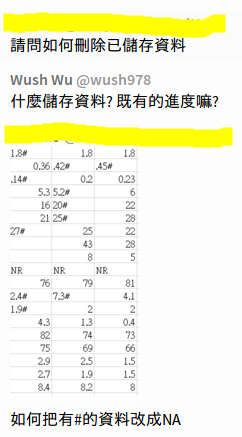

---
title       : "資料型態的CRUD"
author      : "Wush Wu"
job         : 國立台灣大學
framework   : io2012-wush
highlighter : highlight.js
hitheme     : zenburn
widgets     : [mathjax]            # {mathjax, quiz, bootstrap}
mode        : selfcontained # {standalone, draft}
knit        : slidify::knit2slides
--- &vcenter .largecontent

## 大綱

1. 什麼是CRUD?
1. R 語言的資料型態與CRUD


--- &vcenter .largecontent

## CRUD

- Create
- Read
- Update
- Delete

--- &vcenter .largecontent

## CRUD與自學

- 如何學習一個處理特定資料的套件?
    - ex: XML、JSON、Database、Geo Data、Time Series...
- 方法:
    - CRAN Task View
    - Package
    - Vignette
    - Help & Example

--- &vcenter .largecontent

## CRUD與自學

- 目標:
    - Create: 我怎麼建立XML物件?
    - Read: 我怎麼從物件中讀出我想要的資訊?
    - Update: 我怎麼修改既有的資訊?
    - Delete: 我怎麼刪除資訊

--- .dark .segue

## 範例: Vector

--- &vcenter .largecontent

## Vector

- 型態: Character, Numeric, Integer, Logical, (Raw)

--- &vcenter .largecontent

## Create


```r
x <- c("a", "b", "c")
letters # ?letters
```

```
##  [1] "a" "b" "c" "d" "e" "f" "g" "h" "i" "j" "k" "l" "m" "n" "o" "p" "q"
## [18] "r" "s" "t" "u" "v" "w" "x" "y" "z"
```

--- &vcenter .largecontent

## Read


```r
x[1]
```

```
## [1] "a"
```

--- &vcenter .largecontent

## Update


```r
x[1] <- "e"
x
```

```
## [1] "e" "b" "c"
```


--- &vcenter .largecontent

## Delete


```r
x <- x[-3]
x
```

```
## [1] "d" "b"
```

```r
length(x) <- 1
x
```

```
## [1] "d"
```

```r
rm(x)
x
```

```
## Error in eval(expr, envir, enclos): object 'x' not found
```

--- .dark .segue

## 範例: names

--- &vcenter .largecontent

## Create


```r
x1 <- c(a = 1, b = 2, c = 3)
x1
```

```
## a b c 
## 1 2 3
```

```r
x2 <- 1:3
names(x2) <- c("a", "b", "c")
x2
```

```
## a b c 
## 1 2 3
```

```r
x3 <- 1:3
attr(x3, "names") <- c("a", "b", "c")
x3
```

```
## a b c 
## 1 2 3
```

--- &vcenter .largecontent

## Read


```r
names(x1)
```

```
## [1] "a" "b" "c"
```

```r
names(x1)[2]
```

```
## [1] "b"
```

```r
attr(x1, "names")
```

```
## [1] "a" "b" "c"
```

--- &vcenter .largecontent

## Update


```r
names(x1)[2] <- "e"
x1
```

```
## a e c 
## 1 2 3
```

```r
attr(x1, "names")[2] <- "f"
x1
```

```
## a f c 
## 1 2 3
```

--- &vcenter .largecontent

## Delete


```r
names(x1) <- NULL
x1
```

```
## [1] 1 2 3
```

```r
attr(x2, "names") <- NULL
x2
```

```
## [1] 1 2 3
```

--- &vcenter .largecontent

## Remark

- `names(x1)` 其實是透過屬性接上`x1`的character vector
- 透過`names`，可以使用類似Vector的CRUD
    - `names(x1) <- c("a", "b", "c")` v.s. `x <- c("a", "b", "c")`
    - `names(x1)[2]` v.s. `x[2]`
    - `names(x1)[2] <- "e"` v.s. `x[2] <- "e"`
    - `names(x1) <- NULL` v.s. `rm(x)`, Delete 差異較大。有興趣的同學可以自行研究[Environment](http://adv-r.had.co.nz/Environments.html)

--- &vcenter .largecontent

## Remark

- Vector在`[`的使用會依據參數的型態而有所不同
    `x[<參數>]`
    - Integer/Numeric Vector: 位置
    - Logical Vector: 只留下TRUE
    - Character Vector: 與`names(x)`比對
- 因為`names(x)`是一個Character vector, 所以`names(x)[<參數>]`也類似

--- &vcenter .largecontent

## 其他類似的操作

- `class`, `length`, `names`, `dim`等都是常用的屬性，都可以如同上述的方式做CRUD
    - 訣竅在於把`names`替換為其他的名稱，或是

--- .dark .segue

## 範例: list

--- &vcenter .largecontent

## Create


```r
# ?as.character
x <- list(a = 1, b = 1:2, c = as.character(1:3))
```

--- &vcenter .largecontent

## Read: `[[`, `$`


```r
x[[1]]
```

```
## [1] 1
```

```r
x$a
```

```
## [1] 1
```

```r
x[["a"]]
```

```
## [1] 1
```

--- &vcenter .largecontent

## Read: `[`


```r
x[1]
```

```
## $a
## [1] 1
```

```r
x["a"]
```

```
## $a
## [1] 1
```

--- &vcenter .largecontent

## Update


```r
x[[1]] <- 2
x
```

```
## $a
## [1] 2
## 
## $b
## [1] 1 2
## 
## $c
## [1] "1" "2" "3"
```


--- &vcenter .largecontent

## Update


```r
x[[1]] <- "2"
x
```

```
## $a
## [1] "2"
## 
## $b
## [1] 1 2
## 
## $c
## [1] "1" "2" "3"
```

--- &vcenter .largecontent

## Delete


```r
x[[1]] <- NULL
x
```

```
## $b
## [1] 1 2
## 
## $c
## [1] "1" "2" "3"
```

```r
rm(x)
x
```

```
## Error in eval(expr, envir, enclos): object 'x' not found
```

--- &vcenter .largecontent

## Remark

- 請區分清楚`[[`, `$`與`[`在Read功能的不同
    - 結果不同
        - `[[`, `$`會打破List的結構
        - `[`不會打破
    - 參數的型態不同
        - `[[`、`[`可以跟Numeric/Integer Vector, Logical Vector與 Character Vector 一起使用
        - `$`只能接受一個字串(名字)
        - `$`有自動完成:

--- .dark .segue

## 範例: data.frame

--- &vcenter .largecontent

## Create


```r
df <- data.frame(a = 1:3, b = as.character(1:3))
df
```

```
##   a b
## 1 1 1
## 2 2 2
## 3 3 3
```

```r
head(iris)
```

```
##   Sepal.Length Sepal.Width Petal.Length Petal.Width Species
## 1          5.1         3.5          1.4         0.2  setosa
## 2          4.9         3.0          1.4         0.2  setosa
## 3          4.7         3.2          1.3         0.2  setosa
## 4          4.6         3.1          1.5         0.2  setosa
## 5          5.0         3.6          1.4         0.2  setosa
## 6          5.4         3.9          1.7         0.4  setosa
```

--- &vcenter .largecontent

## Read: `[`


```r
df[1,]
```

```
##   a b
## 1 1 1
```

```r
df[1:2,]
```

```
##   a b
## 1 1 1
## 2 2 2
```


--- &vcenter .largecontent

## Read: `[`


```r
df[,1]
```

```
## [1] 1 2 3
```

```r
df[,1:2]
```

```
##   a b
## 1 1 1
## 2 2 2
## 3 3 3
```

--- &vcenter .largecontent

## Read: `[`


```r
df[1:2,1:2]
```

```
##   a b
## 1 1 1
## 2 2 2
```

--- &vcenter .largecontent

## Read: `[[`


```r
df[[1]]
```

```
## [1] 1 2 3
```

```r
df[["a"]]
```

```
## [1] 1 2 3
```


--- &vcenter .largecontent

## Read: `$`


```r
df$a
```

```
## [1] 1 2 3
```

--- &vcenter .largecontent

## Update

- 同Read, 右邊加上assignment `<-` 或 `=`
    - ex: `df$a <- 4:6;a`


--- &vcenter .largecontent

## Delete


```r
df[1,2] <- NA
df
```

```
##   a    b
## 1 1 <NA>
## 2 2    2
## 3 3    3
```

```r
df$a <- NULL
df
```

```
##      b
## 1 <NA>
## 2    2
## 3    3
```

--- &vcenter .largecontent

## Remark

- `data.frame`的`[`接近`matrix`
- `data.frame`的`[[`、`$`與list一模一樣
    - 因為`data.frame`是`list`

--- .dark .segue

## R 物件的CRUD

--- &vcenter .largecontent

## 屬性

- `attr`是汎用解
- 常用的屬性會有對應的函數, ex: `names`、`class`

--- &vcenter .largecontent

## S3物件

- 如同data.frame， 大部分使用`[`, `[[`, `$`做Read / Update / Delete 的操作
- 有些會提供客製化的函數, 例如`colnames`, `rownames`
- 有些則直接使用底層的物件(?)的操作
    - ex: data.frame的`[[`、`$`與list一模一樣

--- &vcenter .largecontent

## S4物件

- 可以把`@`當成類似`$`的操作子
- 等到某天遇到後，同學可以玩玩看

--- &vcenter .largecontent

## 第三周作業的提示

- 我教過得方法: 建立一個空的data.frame，然後寫大量的Update操作把答案寫出來
- 我可能教過得方法: 結合上述方法與`for`或`<?>apply`
- 我沒教過得方法: 直接用`apply`寫出來

--- &vcenter .largecontent

## R語言翻轉教室的課程重點

- 02-DataEngineer 
    - 怎樣的套件處理怎樣的資料格式
    - Read (Why no Create / Update / Delete?)

--- .dark .segue

## 實務經驗分享

--- &vcenter .largecontent

## 拆解問題

<center></img></center>

- 拆解複雜的Update邏輯

--- &vcenter .largecontent

## 拆解問題

- 把有#的資料改成NA
    - 怎麼找到#的位置? `grep`或`grepl`函數
    - 運用Update操作做修改

--- &vcenter .largecontent

## Update 與版本控制

- 儘量不要Update
- 若有Update, 不要更改原來的資料源，改成建立副本

--- .dark .segue

## 隨堂練習

--- &vcenter .largecontent

1. 01-RBasic-05-Arrays-Matrices
2. 更新課程後進行4th-week-01的練習

```r
library(swirl)
install_course_url("http://13.85.30.195/R/exercise/2017-NTUCSX.zip")
# 分流: install_course_url("https://wush978.github.io/R/exercise/2017-NTUCSX.zip")
```


