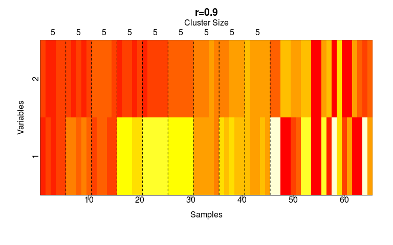

```{r setup, include=FALSE, cache = FALSE}
knitr::opts_chunk$set(echo = TRUE)
# 更換中文字型
if (grepl("darwin", R.version$os)) par(family = "STKaiti", bg = "transparent")
```

## R 的繪圖功能

- 基本功能
- ggplot2

# 基本功能

## 繪圖的要點

```r
if (grepl("darwin", R.version$os)) par(family = "STKaiti", bg = "transparent")
plot(x = 1, y = 1, type = "p", xlab = "x座標軸", ylab = "y座標軸")
```

<div class="columns-2">
```{r plot1, fig.height = 4, fig.width = 4, eval = TRUE, echo = FALSE}
plot(x = 1, y = 1, type = "p", xlab = "x座標軸", ylab = "y座標軸")
```

- 繪圖的要點:
    - 完成主要的繪圖區域
        - 利用x 座標與y 座標定位點、線、面
    - 豐富其他說明文件
        - 例如：x 、y 座標軸與說明
</div>

## 基本API

- 操作對象多是以向量為主
- 高級繪圖函數: `plot`、`images`、`hist`...
- 低級繪圖函數: `points`、`lines`...

## 高級繪圖函數

- 會重新建立圖形的函數

```{r}
plot(x = 1, y = 1, type = "p", xlab = "x座標軸", ylab = "y座標軸")
```

## 低級繪圖函數

- 會在原本的圖上作加註

```{r}
plot(x = 1, y = 1, type = "p", xlab = "x座標軸", ylab = "y座標軸")
abline(v = 1)
abline(h = 1)
```

## 雕圖

- 繪圖相關功能繁複，要畫出漂亮的圖需要不停的「雕刻」



## 雕圖

```{r supc.heatmap, eval = FALSE}
# ...
par() # 獲取現在的圖形做邊範圍
title(...) # 設定圖的標題
mtext(...) # 其他說明文字
abline(...) # 家住虛線
axis(...) # 修正座標軸
# ...
```

## 我是怎麼雕圖的?

- 平時多多累積圖庫相關知識
- 確定需求
    - 來自分析的需求: 說清楚
    - 來自美感的需求
- Google Google Google

## 03-RVisualization-01-One-Variable-Visualization

- 如何呈現數據的教學
- 同時介紹多種基本繪圖的函數

# ggplot2

## 何謂gg?

- 請同學安裝ggplot2套件
- The Grammar of Graphics
- 多利用data.frame
- 利用圖層的概念設計繪圖函數
- 具備`theme`的概念，能夠快速套用別人雕好的設定

## 構成圖形的要素

- x-y plot:
    - x 座標
    - y 座標
- 還有嘛?

## 問ggplot2

```{r}
library(ggplot2)
?geom_point
```

## Aesthetics

- **x**
- **y**
- alpha
- color
- fill
- group
- shape
- size
- stroke

## ggplot

```{r}
g <- ggplot(data = cars, aes(x = speed, y = dist))
```

- 以data.frame為主
- 繪圖的向量來自於data.frame的欄位
    - x: `cars$speed`
    - y: `cars$dist`
- 定義座標的同時不用定義繪圖動作

## x-y scatter plot

```{r}
g + geom_point()
```

- `+`代表添加圖層

## theme

```{r}
g + geom_point() +
  theme_dark()
```

## ggplot2 的撰寫心得

1. 建立data.frame，整理好資料的欄位
1. 利用data.frame建立`gg`、`ggplot`物件
    - 標記共通的`aes`
1. 利用`+`添增圖片的物件與設定
1. `print`方法可以將`gg`、`ggplot`物件轉換成圖片

## 如何精進ggplot2?

- 多多學習他人的範例
- 多多練習與雕圖
- 瀏覽相關的套件

## Top 50 ggplot2 Visualizations

- <http://r-statistics.co/Top50-Ggplot2-Visualizations-MasterList-R-Code.html>

# 繪圖的目的

## 比較數據

- 初階的分析，在於過比較找出差異

## 範例一: iris

- 不同種類的花朵，生物特徵不同

```{r}
ggplot(iris, aes(x = Species, y = Sepal.Length)) +
  geom_boxplot()
```

## 範例二: cars

- 速度不同，煞車後的滑行距離也不同

```{r}
ggplot(cars, aes(x = speed, y = dist)) +
  geom_point()
```

## 許多統計檢定的目的在於比較差異

- 隨機性會造成差異
    - 即使是相同的車速，煞車的滑行距離還是會變化
- 統計檢定: 分辨變化是不是來自隨機性
- 可以利用繪圖方法簡單比較

## 範例一: iris

- 請問setosa與versicolor的Sepal.Length的平均值是否有顯著差異
    - *請問setosa與versicolor的Sepal.Length的平均值的差異是否來自隨機性?*
    - *請問setosa與versicolor的Sepal.Length的平均值的差異是否顯著?*

```{r}
ggplot(iris, aes(x = Species, y = Sepal.Length)) +
  geom_boxplot()
```

## 期末報告的基本要求(B+)

1. 整理兩筆不同來源的Open Data(可以到台灣政府的公開資料平台上尋找資料)
    - 將兩筆資料整合成一個單一的`data.frame`
1. 挑出兩個欄位繪圖做比較
    - 請說明為什麼你選擇這張圖做比較(提示: 解釋欄位的型態是什麼)
1. 寄送電子版的報告「可以但不限於」使用任何軟體製作，但是請一律轉換成A4 直式的 pdf
1. 請同時附上原始資料、整理資料的程式碼與產生圖表的程式碼並把它們**放到相同的資料夾底下**
    - 原始檔中請用註解告訴我，你的圖表示來自哪些程式碼
    - 我會嘗試執行你的程式。如果我跑不出來，會email同學詢問相關問題

## 補充: 圖片的輸出

- 請在Rstudio的`Plots`視窗點選`Export`

## 補充: 表格的輸出

- 請`?write.csv`

## 期末報告的加分要求

- 整理資料
    - 告訴我，你用了什麼我沒教過、翻轉教室也沒提到的技術來整理資料
- 報表製作
    - 告訴我，你用了什麼我沒教過、翻轉教室也沒提到的技術來呈現報告
- 進階分析
    - 告訴我，你用了什麼我沒教過、翻轉教室也沒提到的技術分析資料
- 說清楚你如何在報告中使用你自己學到的技術
    - 這個技術解決了什麼問題

## 建議的加分方向

- 整理資料
- 報表製作(推薦)
    - rmarkdown以及相關的視覺化
    - 利用shiny套件建立動態的Web App呈現你的結果
- 進階分析
    - 「正確」的使用檢定
- 請自學關於R 在處理資料或報表製作上的

## 紙本報告的建議大綱

1. 簡介：你用這兩筆資料回答了什麼問題以及你的答案
1. 資料來源：說明你的資料來源、格式、欄位意義
1. 圖或表：提供你用R 製作的圖表，來支持你的答案
1. (選擇性)：告訴我用到哪些自學的技術、這個技術的用途
1. (選擇性)：參加CS+X的成果發表會

## 範例: Project-ROpenData-Power-GDP


